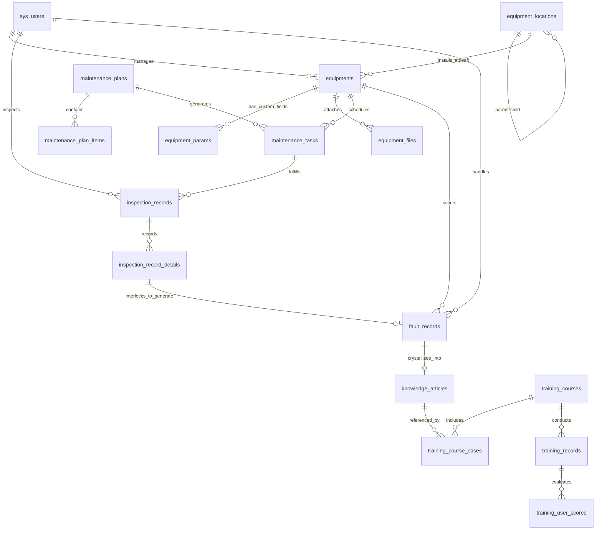
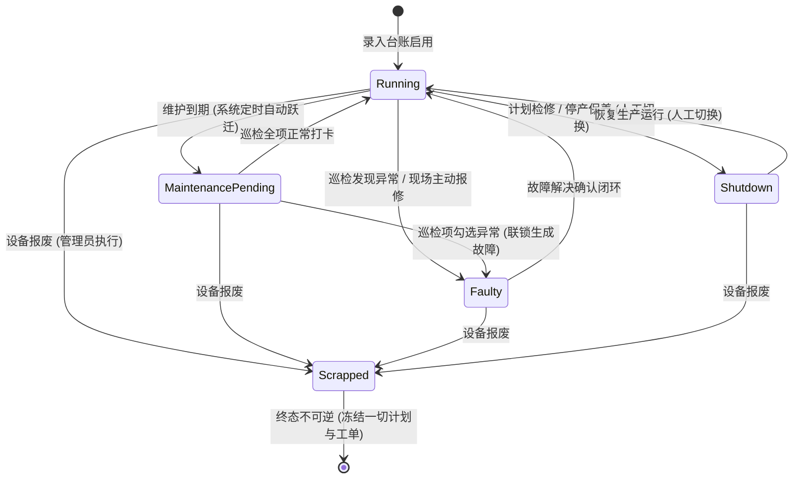
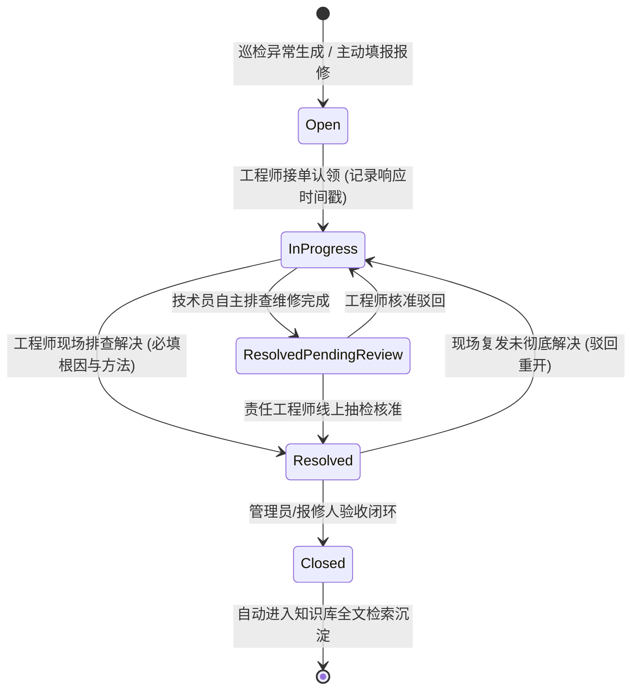
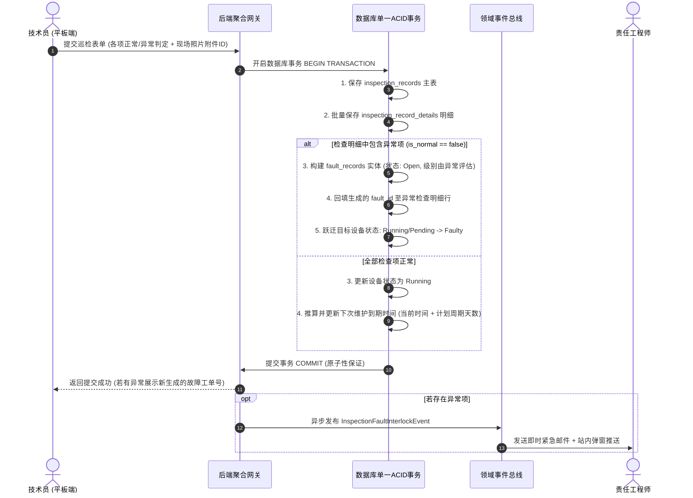

# MaintainWise — 系统设计与技术架构规范文档 (SDD)

> **文档版本**：V1.0  
> **编制日期**：2026-09-05  
> **文档状态**：正式归档  
> **关联文档**：  
> - 需求源文件：[readme.txt](file:///root/MaintainWise/docs/readme.txt)、[requirements_V1.md](file:///root/MaintainWise/docs/requirements_V1.md)  
> - 需求规格说明：[system_requirements_specification.md](file:///root/MaintainWise/docs/system_requirements_specification.md)  
> - 需求反省报告：[requirements_reflection_audit.md](file:///root/MaintainWise/docs/requirements_reflection_audit.md)

---

## 目录
1. [系统总体架构设计](#1-系统总体架构设计)
2. [核心领域模型与业务状态机](#2-核心领域模型与业务状态机)
3. [数据库详细设计 (Schema & Data Dictionary)](#3-数据库详细设计-schema--data-dictionary)
4. [核心算法与后台调度引擎](#4-核心算法与后台调度引擎)
5. [RESTful API 接口契约设计](#5-restful-api-接口契约设计)
6. [安全架构、审计与非功能落地](#6-安全架构审计与非功能落地)
7. [需求全覆盖追踪矩阵 (RTM)](#7-需求全覆盖追踪矩阵-rtm)

---

## 1. 系统总体架构设计

### 1.1 设计原则与架构选型
MaintainWise 专为工业制造车间中高可靠性、高协同性的设备维护管理打造。系统遵循以下核心设计准则：
* **数据闭环 (Closed-Loop Data Flow)**：以设备资产为基石，巡检异常自动联锁生成故障单，故障修复沉淀为知识，知识反哺指导一线排查并支撑技能实训。
* **专业域隔离 (Discipline-Based Isolation)**：电气、机械、自动化专业数据域垂直隔离，兼顾机电复合一体化协同。
* **操作痕迹不可篡改 (Tamper-Resistant Auditability)**：所有业务实体严格软删除，完整保留创建人与修改人审计外键，具备 180 天操作流水追踪。
* **高可用工业交互 (Industrial Reliability)**：离线友好、上传直传解耦、单事务联锁保障 ACID 强一致性。

### 1.2 推荐技术栈选型

| 层次 | 选型组件 | 选型考量与技术优势 |
|:---|:---|:---|
| **前端交互层 (Web/Tablet)** | Vue 3 + TypeScript + Vite + Element Plus + Pinia + ECharts | 适配车间工控平板（触控热区良好），响应式首屏加载 $<2$ 秒，TypeScript 强类型保证 |
| **API 网关与后端服务** | Python FastAPI / Node.js NestJS / Go Gin (模块化架构) | 原生异步 I/O，支持高并发轻量级实时智能推荐，内置 Swagger/OpenAPI 契约文档 |
| **核心持久层数据库** | PostgreSQL 16+ | 强 ACID 事务保证，原生支持 `JSONB` 混合存储 11 类设备专有参数，内置 `pg_trgm` 中文全文检索 |
| **高速缓存与消息中间件** | Redis 7+ | 缓存热点指标卡片、分布式防重发信锁、智能推荐防抖缓存、会话黑名单 |
| **异步任务与定时调度** | Celery + Redis / APScheduler | 支持毫秒级定时倒计时扫描、多节点幂等邮件分发、SLA 超时轮询 |
| **对象存储服务** | MinIO / 本地持久化卷挂载 | 安全哈希重命名存储，物理隔离可执行木马文件，支持图片与大文档流式传输 |
| **邮件通信组件** | 标准 SMTP 客户端 (支持 SSL/TLS) | 适配企业私有化邮件网关（Exchange、Coremail等）与云邮件服务 |

### 1.3 逻辑分层架构图

```
┌────────────────────────────────────────────────────────────────────────┐
│                   表现层 (Presentation Layer - Vue3 + TS)              │
│  [车间工控平板巡检视图]     [工程师技术工作台]     [管理员综合大盘/报表]    │
└───────────────────────────────────┬────────────────────────────────────┘
                                    │ HTTPS (RESTful API / JSON)
┌───────────────────────────────────▼────────────────────────────────────┐
│              网关与安全控制层 (API Gateway & Security Filters)          │
│   JWT 身份认证  │  RBAC 权限守卫  │  工作类型数据域拦截  │  全局审计拦截器 │
└───────────────────────────────────┬────────────────────────────────────┘
                                    │
┌───────────────────────────────────▼────────────────────────────────────┐
│                    应用服务层 (Application Services)                   │
│ ┌───────────────┐ ┌───────────────┐ ┌───────────────┐ ┌──────────────┐ │
│ │  用户权限服务  │ │  设备台账服务  │ │  维护巡检服务  │ │  故障SLA服务  │ │
│ └───────────────┘ └───────────────┘ └───────────────┘ └──────────────┘ │
│ ┌───────────────┐ ┌───────────────┐ ┌───────────────┐ ┌──────────────┐ │
│ │ 知识推荐引擎  │ │  培训档案服务  │ │  数据导入导出  │ │ 邮件调度中心 │ │
│ └───────────────┘ └───────────────┘ └───────────────┘ └──────────────┘ │
└───────────────────────────────────┬────────────────────────────────────┘
                                    │
┌───────────────────────────────────▼────────────────────────────────────┐
│                   领域实体与持久层 (Domain & Persistence)               │
│  PostgreSQL (ACID 事务、JSONB 参数表)  │  Redis (分布式锁、热点缓存)    │
│  MinIO / Local Storage (图纸/程序附件)  │  pg_trgm / 倒排全文检索索引   │
└────────────────────────────────────────────────────────────────────────┘
```

---

## 2. 核心领域模型与业务状态机

### 2.1 核心实体关系模型 (Domain Entity Relationship)



### 2.2 设备生命周期状态机 (REQ-DEV-005)



### 2.3 故障生命周期状态机与 SLA 控制 (REQ-FLT-004, REQ-FLT-008)



### 2.4 巡检异常联锁派发故障单的强一致性时序图 (REQ-MNT-008, 第一次反省)



---

## 3. 数据库详细设计 (Schema & Data Dictionary)

全系统统一标准字段约定：
* 统一主键：`id BIGSERIAL PRIMARY KEY` 或 `UUID`
* 审计留痕：`created_at TIMESTAMP NOT NULL DEFAULT NOW()`, `created_by BIGINT REFERENCES sys_users(id)`, `updated_at TIMESTAMP NOT NULL DEFAULT NOW()`, `updated_by BIGINT REFERENCES sys_users(id)`
* 逻辑删除：`is_deleted BOOLEAN NOT NULL DEFAULT FALSE`
* 字符集编码：`UTF8MB4` / `UTF-8`

### 3.1 用户与权限数据表 (REQ-USR-001 ~ 008)

#### 1. `sys_users` 用户主表
```sql
CREATE TABLE sys_users (
    id BIGSERIAL PRIMARY KEY,
    username VARCHAR(64) NOT NULL UNIQUE,
    password_hash VARCHAR(255) NOT NULL,
    full_name VARCHAR(64) NOT NULL,
    employee_no VARCHAR(32) NOT NULL UNIQUE,
    email VARCHAR(128) NOT NULL,
    phone VARCHAR(32),
    role_code VARCHAR(32) NOT NULL, -- 'ADMIN', 'ENGINEER', 'TECHNICIAN'
    work_type VARCHAR(32) NOT NULL, -- 'ELECTRICAL', 'MECHANICAL', 'AUTOMATION', 'GENERAL'
    is_active BOOLEAN NOT NULL DEFAULT TRUE, -- 仅支持软禁用
    force_change_password BOOLEAN NOT NULL DEFAULT TRUE, -- 首次登录强制改密
    password_updated_at TIMESTAMP NOT NULL DEFAULT NOW(),
    failed_login_attempts INT NOT NULL DEFAULT 0,
    locked_until TIMESTAMP,
    created_at TIMESTAMP NOT NULL DEFAULT NOW(),
    created_by BIGINT,
    updated_at TIMESTAMP NOT NULL DEFAULT NOW(),
    updated_by BIGINT,
    is_deleted BOOLEAN NOT NULL DEFAULT FALSE
);
CREATE INDEX idx_users_role_work ON sys_users(role_code, work_type);
CREATE INDEX idx_users_email ON sys_users(email);
```

#### 2. `sys_audit_logs` 180天不可篡改操作审计日志表 (REQ-SYS-005)
```sql
CREATE TABLE sys_audit_logs (
    id BIGSERIAL PRIMARY KEY,
    user_id BIGINT,
    username VARCHAR(64),
    client_ip VARCHAR(45) NOT NULL,
    module_name VARCHAR(64) NOT NULL,
    action_type VARCHAR(32) NOT NULL, -- 'CREATE', 'UPDATE', 'DELETE', 'EXPORT'
    request_url VARCHAR(255) NOT NULL,
    request_method VARCHAR(10) NOT NULL,
    diff_payload JSONB, -- 记录变更前后 diff 差异
    status_code INT NOT NULL,
    created_at TIMESTAMP NOT NULL DEFAULT NOW()
    -- 严禁物理删除，只允许 APPEND，保存至少 180 天
);
CREATE INDEX idx_audit_created_at ON sys_audit_logs(created_at);
CREATE INDEX idx_audit_module ON sys_audit_logs(module_name, action_type);
```

---

### 3.2 设备台账与位置层级数据表 (REQ-DEV-001 ~ 009)

#### 3. `equipment_locations` 5级位置分类树表 (REQ-DEV-001, 002)
```sql
CREATE TABLE equipment_locations (
    id BIGSERIAL PRIMARY KEY,
    parent_id BIGINT REFERENCES equipment_locations(id) ON DELETE RESTRICT,
    location_name VARCHAR(128) NOT NULL,
    location_code VARCHAR(64) NOT NULL UNIQUE,
    level_depth INT NOT NULL CHECK (level_depth BETWEEN 1 AND 5), -- 最大5级
    tree_path VARCHAR(255) NOT NULL, -- 如 '/1/4/12/' 便于高效递归检索
    is_leaf BOOLEAN NOT NULL DEFAULT TRUE, -- 仅叶子节点可挂载设备
    sort_order INT NOT NULL DEFAULT 0,
    created_at TIMESTAMP NOT NULL DEFAULT NOW(),
    created_by BIGINT REFERENCES sys_users(id),
    updated_at TIMESTAMP NOT NULL DEFAULT NOW(),
    updated_by BIGINT REFERENCES sys_users(id),
    is_deleted BOOLEAN NOT NULL DEFAULT FALSE
);
CREATE INDEX idx_loc_parent ON equipment_locations(parent_id);
CREATE INDEX idx_loc_path ON equipment_locations(tree_path);
```

#### 4. `equipments` 设备台账主表 (REQ-DEV-003, 005)
```sql
CREATE TABLE equipments (
    id BIGSERIAL PRIMARY KEY,
    equipment_code VARCHAR(64) NOT NULL UNIQUE,
    equipment_name VARCHAR(128) NOT NULL,
    equipment_type VARCHAR(32) NOT NULL, -- SENSOR, PLC, FAN, MOTOR, INVERTER, HMI, SERVO, HYDRAULIC, PNEUMATIC, CONVEYOR, OTHER
    work_type VARCHAR(32) NOT NULL, -- 归属专业: ELECTRICAL, MECHANICAL, AUTOMATION, GENERAL
    location_id BIGINT NOT NULL REFERENCES equipment_locations(id) ON DELETE RESTRICT,
    manufacturer VARCHAR(128),
    model_spec VARCHAR(128) NOT NULL,
    serial_number VARCHAR(128),
    purchase_date DATE,
    commission_date DATE,
    warranty_expiry_date DATE,
    maintenance_interval_days INT NOT NULL DEFAULT 30, -- 基准周期
    next_maintenance_date DATE,
    responsible_engineer_id BIGINT REFERENCES sys_users(id),
    status VARCHAR(32) NOT NULL DEFAULT 'RUNNING', -- RUNNING, MAINTENANCE_PENDING, FAULTY, SHUTDOWN, SCRAPPED
    created_at TIMESTAMP NOT NULL DEFAULT NOW(),
    created_by BIGINT REFERENCES sys_users(id),
    updated_at TIMESTAMP NOT NULL DEFAULT NOW(),
    updated_by BIGINT REFERENCES sys_users(id),
    is_deleted BOOLEAN NOT NULL DEFAULT FALSE
);
CREATE INDEX idx_eq_code_name ON equipments(equipment_code, equipment_name);
CREATE INDEX idx_eq_type_work ON equipments(equipment_type, work_type);
CREATE INDEX idx_eq_status ON equipments(status);
CREATE INDEX idx_eq_next_maint ON equipments(next_maintenance_date);
```

#### 5. `equipment_params` 11类设备专有参数扩展表 (REQ-DEV-004)
```sql
CREATE TABLE equipment_params (
    equipment_id BIGINT PRIMARY KEY REFERENCES equipments(id) ON DELETE CASCADE,
    -- 强类型常用核心工业字段
    rated_power_kw NUMERIC(10, 2),
    rated_voltage_v NUMERIC(10, 2),
    rated_current_a NUMERIC(10, 2),
    rated_speed_rpm INT,
    air_volume_m3h NUMERIC(10, 2),
    air_pressure_pa NUMERIC(10, 2),
    ip_address VARCHAR(45),
    comm_protocol VARCHAR(64),
    io_points_spec VARCHAR(128),
    pressure_range_mpa NUMERIC(10, 2),
    measurement_range VARCHAR(64),
    output_signal_type VARCHAR(64),
    accuracy_class VARCHAR(32),
    -- 自定义扩展动态参数
    extra_params JSONB NOT NULL DEFAULT '{}'::jsonb
);
```

#### 6. `equipment_files` 设备与维保标签化附件表 (REQ-DEV-006, REQ-SYS-006)
```sql
CREATE TABLE equipment_files (
    id BIGSERIAL PRIMARY KEY,
    equipment_id BIGINT REFERENCES equipments(id) ON DELETE SET NULL,
    file_tag VARCHAR(32) NOT NULL, -- PHOTO, NAMEPLATE, MANUAL, SCHEMATIC, PLC_PROG, FAULT_IMG, OTHER
    original_filename VARCHAR(255) NOT NULL,
    storage_path VARCHAR(512) NOT NULL,
    file_size_bytes BIGINT NOT NULL,
    mime_type VARCHAR(128) NOT NULL,
    file_sha256 VARCHAR(64) NOT NULL,
    created_at TIMESTAMP NOT NULL DEFAULT NOW(),
    created_by BIGINT REFERENCES sys_users(id)
);
CREATE INDEX idx_files_eq_tag ON equipment_files(equipment_id, file_tag);
```

---

### 3.3 维护计划与巡检执行数据表 (REQ-MNT-001 ~ 011)

#### 7. `maintenance_plans` 维护计划与 SOP 表 (REQ-MNT-001, 003)
```sql
CREATE TABLE maintenance_plans (
    id BIGSERIAL PRIMARY KEY,
    plan_code VARCHAR(64) NOT NULL UNIQUE,
    plan_name VARCHAR(128) NOT NULL,
    plan_type VARCHAR(32) NOT NULL, -- DAILY, WEEKLY, MONTHLY, ANNUAL
    interval_days INT NOT NULL,
    version_no VARCHAR(16) NOT NULL DEFAULT 'V1.0',
    sop_content TEXT NOT NULL, -- SOP富文本指导内容
    is_active BOOLEAN NOT NULL DEFAULT TRUE,
    created_at TIMESTAMP NOT NULL DEFAULT NOW(),
    created_by BIGINT REFERENCES sys_users(id),
    updated_at TIMESTAMP NOT NULL DEFAULT NOW(),
    updated_by BIGINT REFERENCES sys_users(id),
    is_deleted BOOLEAN NOT NULL DEFAULT FALSE
);
```

#### 8. `maintenance_plan_items` 维护检查清单配置表 (REQ-MNT-002)
```sql
CREATE TABLE maintenance_plan_items (
    id BIGSERIAL PRIMARY KEY,
    plan_id BIGINT NOT NULL REFERENCES maintenance_plans(id) ON DELETE CASCADE,
    item_order INT NOT NULL DEFAULT 1,
    check_item_name VARCHAR(128) NOT NULL,
    standard_benchmark TEXT NOT NULL,
    guide_image_id BIGINT REFERENCES equipment_files(id),
    is_required BOOLEAN NOT NULL DEFAULT TRUE
);
CREATE INDEX idx_plan_items ON maintenance_plan_items(plan_id, item_order);
```

#### 9. `maintenance_tasks` 维护待办调度工单表 (REQ-MNT-004, 006)
```sql
CREATE TABLE maintenance_tasks (
    id BIGSERIAL PRIMARY KEY,
    task_code VARCHAR(64) NOT NULL UNIQUE,
    plan_id BIGINT NOT NULL REFERENCES maintenance_plans(id),
    equipment_id BIGINT NOT NULL REFERENCES equipments(id),
    assigned_tech_id BIGINT REFERENCES sys_users(id),
    plan_version_snapshot VARCHAR(16) NOT NULL, -- 快照版本
    scheduled_date DATE NOT NULL,
    due_date DATE NOT NULL,
    status VARCHAR(32) NOT NULL DEFAULT 'PENDING', -- PENDING, IN_PROGRESS, COMPLETED, OVERDUE
    completed_at TIMESTAMP,
    is_overdue BOOLEAN NOT NULL DEFAULT FALSE,
    created_at TIMESTAMP NOT NULL DEFAULT NOW()
);
CREATE INDEX idx_tasks_eq_due ON maintenance_tasks(equipment_id, due_date, status);
```

#### 10. `inspection_records` 巡检打卡执行总表 (REQ-MNT-007, 008)
```sql
CREATE TABLE inspection_records (
    id BIGSERIAL PRIMARY KEY,
    task_id BIGINT REFERENCES maintenance_tasks(id),
    equipment_id BIGINT NOT NULL REFERENCES equipments(id),
    snapshot_location_id BIGINT NOT NULL REFERENCES equipment_locations(id), -- 工位快照
    inspector_id BIGINT NOT NULL REFERENCES sys_users(id),
    has_anomaly BOOLEAN NOT NULL DEFAULT FALSE, -- 是否发现异常
    execution_start_time TIMESTAMP NOT NULL,
    execution_end_time TIMESTAMP NOT NULL DEFAULT NOW(),
    overall_remarks TEXT,
    created_at TIMESTAMP NOT NULL DEFAULT NOW()
);
CREATE INDEX idx_insp_eq_date ON inspection_records(equipment_id, created_at);
```

#### 11. `inspection_record_details` 逐项巡检打卡明细表 (REQ-MNT-007, 008)
```sql
CREATE TABLE inspection_record_details (
    id BIGSERIAL PRIMARY KEY,
    record_id BIGINT NOT NULL REFERENCES inspection_records(id) ON DELETE CASCADE,
    plan_item_id BIGINT NOT NULL,
    check_item_name_snapshot VARCHAR(128) NOT NULL,
    is_normal BOOLEAN NOT NULL, -- TRUE:正常, FALSE:异常
    anomaly_desc TEXT, -- 异常时必填
    evidence_file_id BIGINT REFERENCES equipment_files(id), -- 异常时强制必填照片
    interlocked_fault_id BIGINT -- 自动联锁生成的故障单外键
);
CREATE INDEX idx_insp_detail_rec ON inspection_record_details(record_id);
```

---

### 3.4 故障管理与知识库数据表 (REQ-FLT-001 ~ 009, REQ-KB-001 ~ 006)

#### 12. `fault_records` 故障全流程跟踪表 (REQ-FLT-001, 004, 006, 008)
```sql
CREATE TABLE fault_records (
    id BIGSERIAL PRIMARY KEY,
    fault_code VARCHAR(64) NOT NULL UNIQUE,
    source_type VARCHAR(32) NOT NULL, -- 'INSPECTION_AUTO' (巡检自动生成), 'MANUAL_REPORT' (突发报修)
    equipment_id BIGINT NOT NULL REFERENCES equipments(id),
    snapshot_location_id BIGINT NOT NULL REFERENCES equipment_locations(id), -- 发生时工位快照
    fault_title VARCHAR(128) NOT NULL,
    fault_desc TEXT NOT NULL,
    fault_system VARCHAR(64) NOT NULL, -- ELECTRICAL, MECHANICAL, HYDRAULIC, PNEUMATIC, CONTROL, SOFTWARE
    fault_part VARCHAR(128) NOT NULL,
    severity_level VARCHAR(32) NOT NULL, -- 'CRITICAL', 'MAJOR', 'MINOR'
    status VARCHAR(32) NOT NULL DEFAULT 'OPEN', -- OPEN, IN_PROGRESS, RESOLVED_PENDING_REVIEW, RESOLVED, CLOSED, REOPENED
    
    reported_by BIGINT NOT NULL REFERENCES sys_users(id),
    reported_at TIMESTAMP NOT NULL DEFAULT NOW(),
    
    assigned_engineer_id BIGINT REFERENCES sys_users(id),
    claimed_at TIMESTAMP, -- 接单响应时间
    
    root_cause TEXT, -- 根本原因 (闭环必填)
    solution_steps TEXT, -- 解决方案 (闭环必填)
    downtime_minutes INT DEFAULT 0,
    is_featured_case BOOLEAN NOT NULL DEFAULT FALSE, -- 标定为典型案例
    
    resolved_at TIMESTAMP,
    closed_at TIMESTAMP,
    
    is_sla_response_breached BOOLEAN NOT NULL DEFAULT FALSE,
    is_sla_resolve_breached BOOLEAN NOT NULL DEFAULT FALSE,
    
    created_at TIMESTAMP NOT NULL DEFAULT NOW(),
    created_by BIGINT REFERENCES sys_users(id),
    updated_at TIMESTAMP NOT NULL DEFAULT NOW(),
    updated_by BIGINT REFERENCES sys_users(id),
    is_deleted BOOLEAN NOT NULL DEFAULT FALSE
);
CREATE INDEX idx_fault_status_sev ON fault_records(status, severity_level);
CREATE INDEX idx_fault_eq_rep ON fault_records(equipment_id, reported_at);
CREATE INDEX idx_fault_featured ON fault_records(is_featured_case);
```

#### 13. `knowledge_articles` 维修知识库全文检索表 (REQ-KB-001 ~ 005)
```sql
CREATE TABLE knowledge_articles (
    id BIGSERIAL PRIMARY KEY,
    article_code VARCHAR(64) NOT NULL UNIQUE,
    source_fault_id BIGINT REFERENCES fault_records(id) ON DELETE SET NULL,
    equipment_type VARCHAR(32) NOT NULL,
    equipment_model VARCHAR(128) NOT NULL,
    fault_system VARCHAR(64) NOT NULL,
    fault_title VARCHAR(128) NOT NULL,
    fault_phenomenon TEXT NOT NULL,
    root_cause TEXT NOT NULL,
    solution_steps TEXT NOT NULL,
    tags VARCHAR(255)[], -- 标签数组，如 ARRAY['#轴承磨损', '#异响']
    is_featured BOOLEAN NOT NULL DEFAULT FALSE,
    view_count INT NOT NULL DEFAULT 0,
    helpful_count INT NOT NULL DEFAULT 0,
    search_vector TSVECTOR, -- 全文检索倒排索引向量
    created_at TIMESTAMP NOT NULL DEFAULT NOW(),
    created_by BIGINT REFERENCES sys_users(id),
    updated_at TIMESTAMP NOT NULL DEFAULT NOW(),
    updated_by BIGINT REFERENCES sys_users(id),
    is_deleted BOOLEAN NOT NULL DEFAULT FALSE
);
CREATE INDEX idx_kb_vector ON knowledge_articles USING GIN(search_vector);
CREATE INDEX idx_kb_type_system ON knowledge_articles(equipment_type, fault_system, is_featured);
```

---

### 3.5 培训管理与技能档案数据表 (REQ-TRN-001 ~ 005)

#### 14. `training_courses` 培训课程主表 (REQ-TRN-001)
```sql
CREATE TABLE training_courses (
    id BIGSERIAL PRIMARY KEY,
    course_code VARCHAR(64) NOT NULL UNIQUE,
    course_name VARCHAR(128) NOT NULL,
    course_category VARCHAR(64) NOT NULL, -- ONBOARDING, SPECIAL_EQUIP, ANNUAL_SAFETY, FAULT_CASE_STUDY
    planned_hours NUMERIC(4, 1) NOT NULL,
    description TEXT,
    material_file_id BIGINT REFERENCES equipment_files(id),
    created_at TIMESTAMP NOT NULL DEFAULT NOW(),
    created_by BIGINT REFERENCES sys_users(id),
    updated_at TIMESTAMP NOT NULL DEFAULT NOW(),
    updated_by BIGINT REFERENCES sys_users(id),
    is_deleted BOOLEAN NOT NULL DEFAULT FALSE
);
```

#### 15. `training_course_cases` 课程挂接知识库典型案例表 (REQ-TRN-002)
```sql
CREATE TABLE training_course_cases (
    id BIGSERIAL PRIMARY KEY,
    course_id BIGINT NOT NULL REFERENCES training_courses(id) ON DELETE CASCADE,
    article_id BIGINT NOT NULL REFERENCES knowledge_articles(id) ON DELETE CASCADE,
    UNIQUE (course_id, article_id)
);
```

#### 16. `training_records` 培训实施过程凭证记录表 (REQ-TRN-003)
```sql
CREATE TABLE training_records (
    id BIGSERIAL PRIMARY KEY,
    course_id BIGINT NOT NULL REFERENCES training_courses(id),
    training_date DATE NOT NULL,
    instructor_name VARCHAR(64) NOT NULL,
    location VARCHAR(128) NOT NULL,
    live_photo_id BIGINT REFERENCES equipment_files(id),
    created_at TIMESTAMP NOT NULL DEFAULT NOW(),
    created_by BIGINT REFERENCES sys_users(id)
);
```

#### 17. `training_user_scores` 学员成绩、考核与复训表 (REQ-TRN-004, 005)
```sql
CREATE TABLE training_user_scores (
    id BIGSERIAL PRIMARY KEY,
    training_record_id BIGINT NOT NULL REFERENCES training_records(id) ON DELETE CASCADE,
    user_id BIGINT NOT NULL REFERENCES sys_users(id),
    assessment_type VARCHAR(32) NOT NULL, -- WRITTEN, PRACTICAL, ORAL
    score NUMERIC(5, 2) NOT NULL,
    is_passed BOOLEAN NOT NULL,
    need_retraining BOOLEAN NOT NULL DEFAULT FALSE, -- 考核不合格触发复训
    retraining_completed BOOLEAN NOT NULL DEFAULT FALSE,
    created_at TIMESTAMP NOT NULL DEFAULT NOW()
);
CREATE INDEX idx_train_score_user ON training_user_scores(user_id, is_passed);
```

---

### 3.6 调度引擎与通知配置表 (REQ-SYS-001 ~ 003, REQ-MNT-005)

#### 18. `maintenance_notify_configs` 提前提醒策略配置表
```sql
CREATE TABLE maintenance_notify_configs (
    id BIGSERIAL PRIMARY KEY,
    lead_days INT NOT NULL UNIQUE, -- 提前天数: 如 7, 3, 1, 0(当天)
    is_enabled BOOLEAN NOT NULL DEFAULT TRUE,
    target_role_group VARCHAR(32) NOT NULL DEFAULT 'ALL', -- ALL, ELECTRICAL, MECHANICAL, AUTOMATION
    updated_at TIMESTAMP NOT NULL DEFAULT NOW(),
    updated_by BIGINT REFERENCES sys_users(id)
);
```

#### 19. `maintenance_notify_logs` 调度幂等发信防重记录表 (第二次反省风险2)
```sql
CREATE TABLE maintenance_notify_logs (
    id BIGSERIAL PRIMARY KEY,
    equipment_id BIGINT NOT NULL REFERENCES equipments(id),
    task_id BIGINT REFERENCES maintenance_tasks(id),
    target_notify_date DATE NOT NULL,
    notify_stage INT NOT NULL, -- 对应的提前天数，如 7, 3, 1
    recipient_email VARCHAR(128) NOT NULL,
    sent_at TIMESTAMP NOT NULL DEFAULT NOW(),
    status VARCHAR(16) NOT NULL DEFAULT 'SUCCESS',
    UNIQUE (equipment_id, target_notify_date, notify_stage, recipient_email)
);
CREATE INDEX idx_notify_log_dedup ON maintenance_notify_logs(equipment_id, target_notify_date, notify_stage);
```

#### 20. `sys_smtp_configs` 系统邮件发信服务器配置表 (REQ-SYS-001)
```sql
CREATE TABLE sys_smtp_configs (
    id BIGSERIAL PRIMARY KEY,
    smtp_host VARCHAR(128) NOT NULL, -- SMTP 主机地址，如 smtp.exmail.qq.com
    smtp_port INT NOT NULL DEFAULT 465, -- 端口号: 465 (SSL), 587 (STARTTLS), 25
    smtp_user VARCHAR(128) NOT NULL, -- 认证用户名 / 发件邮箱账号
    smtp_pass VARCHAR(255) NOT NULL, -- 授权密码/Token (支持页面脱敏与加密保护)
    sender_name VARCHAR(64) NOT NULL DEFAULT 'MaintainWise 智能运维中心', -- 发件人显示昵称
    use_ssl BOOLEAN NOT NULL DEFAULT TRUE, -- 是否启用 SSL/TLS
    use_tls BOOLEAN NOT NULL DEFAULT FALSE, -- 是否启用 STARTTLS
    is_active BOOLEAN NOT NULL DEFAULT TRUE, -- 服务总开关
    updated_at TIMESTAMP NOT NULL DEFAULT NOW(),
    updated_by BIGINT REFERENCES sys_users(id)
);
```

---

## 4. 核心算法与后台调度引擎

### 4.1 故障实时智能推荐算法引擎设计 (REQ-FLT-003, REQ-KB-004)

为兼顾毫秒级响应、冷启动平滑与大语料准确性，智能推荐系统采用**双阶段混合评分模型 (Two-Stage Hybrid Recommendation)**：

```
[技术员键入故障文本 (防抖 300ms)]
                │
                ▼
┌──────────────────────────────────────────────┐
│ 第一阶段：元数据硬过滤 (Candidate Filtering)   │
│ - 匹配当前设备类型 equipment_type (权值高)     │
│ - 匹配当前故障系统 fault_system (可选)        │
│ 快速将候选集从 10,000+ 缩减至 <= 50 条         │
└──────────────────────┬───────────────────────┘
                       │
                       ▼
┌──────────────────────────────────────────────┐
│ 第二阶段：语义加权打分 (Hybrid Scoring)       │
│ Score = w1 * Sim_text(BM25/余弦)             │
│       + w2 * Match(设备型号)                  │
│       + w3 * Match(具体部件)                  │
│       + w4 * IsFeatured(是否典型案例加权)      │
└──────────────────────┬───────────────────────┘
                       │
                       ▼
┌──────────────────────────────────────────────┐
│ 排序过滤与输出 (Top-N Output)                 │
│ - 过滤得分 >= 60% 的候选项                    │
│ - 截取 Top-3 返回前台卡片展示                  │
│ - 结果写入 Redis 缓存 (TTL: 10 分钟)          │
└──────────────────────────────────────────────┘
```

#### 算法公式与参数权重设定：
$$Score = 0.50 \times S_{\text{text}} + 0.20 \times I_{\text{model}} + 0.20 \times I_{\text{part}} + 0.10 \times I_{\text{featured}}$$

其中：
* $S_{\text{text}}$：故障现象与历史记录文本的 BM25 / pg_trgm 相似度得分 ($0 \sim 1$)
* $I_{\text{model}}$：设备规格型号完全一致记 1.0，同系列记 0.5，不一致记 0
* $I_{\text{part}}$：故障部件位置命中相同专业词（如“轴承”、“电容”）记 1.0，否则记 0
* $I_{\text{featured}}$：为系统标定的“典型案例”则额外获得 1.0 加成

### 4.2 维护调度与动态倒计时推算算法 (REQ-MNT-004, 006)

每日零点，后台调度器执行全量设备扫描：
1. **状态前置判定**：检查设备 `status`。若为 `SHUTDOWN` 或 `SCRAPPED`，跳过调度。
2. **倒计时与到期推算**：
   $$\Delta t = \text{next\_maintenance\_date} - \text{current\_date}$$
   * 若 $\Delta t = 0$ 且设备状态为 `RUNNING`：系统自动更新设备状态为 `MAINTENANCE_PENDING`，并在 `maintenance_tasks` 中生成派发任务。
   * 若 $\Delta t \in \{7, 3, 1\}$：查询 `maintenance_notify_configs`，若该阶段开启，且在 `maintenance_notify_logs` 中不存在已发记录，则向责任组投递邮件。
   * 若 $\Delta t < -3$ 且任务未完成：标记任务为 `OVERDUE`，每日清晨 08:00 投递催办告警邮件。

### 4.3 SLA 破线告警轮询引擎 (REQ-FLT-008)

后台常驻每 5 分钟轮询一次未闭环故障单：
* **响应时效监控**：
  $$\Delta t_{\text{resp}} = \text{now}() - \text{reported\_at}$$
  若仍处于 `OPEN` 且 $\Delta t_{\text{resp}} > \text{SLA\_Response\_Limit}$，标记 `is_sla_response_breached = TRUE` 并发送升级催办。
* **解决时效监控**：
  $$\Delta t_{\text{resolve}} = \text{now}() - \text{reported\_at}$$
  若未进入 `RESOLVED` 或 `CLOSED` 且 $\Delta t_{\text{resolve}} > \text{SLA\_Resolve\_Limit}$，标记 `is_sla_resolve_breached = TRUE`，在首页大盘高亮显示破线红牌。

---

## 5. RESTful API 接口契约设计

所有业务接口遵循 RESTful 规范，基准路径为 `/api/v1`。

### 5.1 身份认证与用户管理 (REQ-USR-001 ~ 008)
* `POST /api/v1/auth/login`：用户账号密码登录，成功返回 JWT Token及用户信息。
* `POST /api/v1/auth/logout`：注销登录，Token 加入 Redis 黑名单。
* `POST /api/v1/auth/force-change-password`：首次登录或定期强制修改初始密码。
* `POST /api/v1/auth/forgot-password`：输入邮箱发送 15 分钟临时重置链接。
* `POST /api/v1/auth/reset-password`：校验重置 Token 并提交新密码。
* `GET /api/v1/users`：分页查询用户列表（仅管理员，支持工号/姓名/角色过滤）。
* `POST /api/v1/users`：创建新用户（工号、角色、专业工作类型）。
* `PUT /api/v1/users/{id}`：更新用户账号资料与启禁用状态（仅管理员）。
* `DELETE /api/v1/users/{id}`：安全软删除用户账号（仅管理员，保留历史业务审计外键）。

### 5.2 设备台账与位置层级 (REQ-DEV-001 ~ 009)
* `GET /api/v1/locations/tree`：获取 5 级位置分类树形拓扑结构。
* `POST /api/v1/locations`：创建位置分类节点（非叶子节点禁止挂设备）。
* `DELETE /api/v1/locations/{id}`：删除节点（严格防孤儿校验：存在子节点或挂载设备时拦截）。
* `GET /api/v1/equipments`：综合条件分页查询设备台账（自动注入工作类型数据域过滤）。
* `GET /api/v1/equipments/{id}`：获取设备全量台账档案及 11 类专有参数。
* `POST /api/v1/equipments`：新建设备台账（通用字段 + 专有动态参数）。
* `PUT /api/v1/equipments/{id}`：更新设备台账信息。
* `PUT /api/v1/equipments/{id}/status`：人工切换设备运行/停机状态。
* `DELETE /api/v1/equipments/{id}`：安全软删除设备（仅管理员与工程师权限）。
* `GET /api/v1/equipments/{id}/timeline`：获取设备全生命周期电子维修履历时间线。
* `POST /api/v1/equipments/import`：Excel 批量导入设备台账（返回解析预览及校验清单）。
* `GET /api/v1/equipments/export`：按筛选条件导出设备台账 Excel。

### 5.3 维护计划与现场巡检 (REQ-MNT-001 ~ 011)
* `GET /api/v1/maintenance/plans`：获取维护计划列表与 SOP。
* `POST /api/v1/maintenance/plans`：新建维护计划与检查清单。
* `PUT /api/v1/maintenance/plans/{id}`：修改维护计划（自动触发版本升迁 V1.0 $\rightarrow$ V1.1）。
* `GET /api/v1/maintenance/my-tasks`：技术员查询当前登录人的待执行巡检任务列表。
* `POST /api/v1/maintenance/inspections/submit`：**现场巡检打卡核心聚合接口**（单数据库事务原子处理：打卡记录、异常检测、自动联锁生成故障单、设备状态跃迁）。
* `GET /api/v1/maintenance/statistics/completion-rate`：多维度统计维护按时完成率。

### 5.4 故障管理与知识库检索 (REQ-FLT-001 ~ 009, REQ-KB-001 ~ 006)
* `POST /api/v1/faults/recommend-similar`：**录入故障时实时智能排查推荐**（输入文本，返回相似案例 Top-3）。
* `POST /api/v1/faults`：现场突发主动报修录入。
* `GET /api/v1/faults`：分页查询故障单列表（支持状态、等级、SLA超时过滤）。
* `PUT /api/v1/faults/{id}/claim`：工程师接手处理故障单。
* `POST /api/v1/faults/{id}/resolve`：录入维修结果（强制必填根因分析、解决方案与步骤）。
* `PUT /api/v1/faults/{id}/close`：确认验收并归档关闭故障单（自动触发知识库沉淀）。
* `GET /api/v1/knowledge/search`：知识库高性能全文检索与多维筛选。
* `PUT /api/v1/knowledge/{id}/feature`：标定/取消“典型故障案例”。

### 5.5 培训管理与工作台大盘 (REQ-TRN-001 ~ 005, REQ-DSH-001 ~ 004)
* `POST /api/v1/training/courses`：创建培训课程（支持直接关联挂接知识库典型案例）。
* `POST /api/v1/training/records`：录入培训现场实施纪实与签到。
* `POST /api/v1/training/scores`：录入学员考核成绩（不合格自动标记待复训）。
* `GET /api/v1/training/profile/{userId}`：查询员工全生命周期技术技能成长档案。
* `GET /api/v1/dashboard/metrics`：获取首页顶部核心资产健康度统计卡片。
* `GET /api/v1/dashboard/my-todo`：获取基于角色的差异化智能待办工作台列表。
* `GET /api/v1/dashboard/charts`：获取 30 天故障发生趋势与维护完成率图表数据。

---

## 6. 安全架构、审计与非功能落地

### 6.1 安全架构设计 (REQ-NFR-001, REQ-USR-006)
1. **密码学存储**：用户口令使用带有随机 Salt 的 `bcrypt` 算法哈希加盐存储（Cost 因子 = 12）。
2. **防暴破拦截中间件**：基于 Redis 记录 IP 和用户名失败计数。连续 5 次失败，触发 15 分钟锁定期。
3. **生产单班次会话与 Token 超时**：Access Token 有效期设定为 480 分钟（8小时），全面覆盖车间 8 小时单班次免重复登录；前端监听无键鼠事件连续 30 分钟触发安全登出。
4. **防越权数据隔离切面**：
   ```python
   # 数据权限切面伪代码
   def apply_work_type_scope(query, current_user):
       if current_user.role == 'ADMIN' or current_user.work_type == 'GENERAL':
           return query # 综合/管理员放行全量设备
       # 电气/机械/自动化仅允许查询归属专业设备
       return query.filter(Equipment.work_type == current_user.work_type)
   ```

### 6.2 180天操作审计与防篡改策略 (REQ-SYS-005)
1. **统一审计切面**：对所有 `POST`、`PUT`、`DELETE` 操作自动拦截，异步提取请求人、IP、变更前数据镜像与变更后 Payload，格式化计算 JSON Diff。
2. **只读保护**：在 PostgreSQL 中为 `sys_audit_logs` 表单独配置数据库角色权限：仅赋予 `INSERT` 和 `SELECT` 权限，撤销任何 `UPDATE` 与 `DELETE` 权限，杜绝即使是系统管理员在应用界面的篡改可能。
3. **自动轮转与归档**：使用定时分区表或日志滚动脚本，保留最近 180 天在线热数据，超过 180 天的数据导出压缩包至安全冷存储后归档。

### 6.3 工业现场文件传输与防护 (REQ-SYS-006)
1. **直传解耦机制**：前端上传照片/文件 $\rightarrow$ 文件存储服务生成 UUID 随机文件名 $\rightarrow$ 校验文件二进制魔数（Magic Number 校验实际 MIME 类型，拦截改名伪装的脚本文件） $\rightarrow$ 存储后返回唯一 File ID。
2. **大小控制**：现场照片单张 $\le 10$ MB，PDF/程序附件单个 $\le 50$ MB。

### 6.4 前端细粒度 RBAC 与无权限功能直接关闭机制 (REQ-USR-001)
1. **侧边栏菜单级物理收敛**：管理员专用模块（用户与班组管理、系统设置与审计）由 `v-if="authStore.isAdmin"` 控制，非管理员角色（车间主管、工程师、技术员）左侧菜单完全不展示入口。
2. **全局指令 `v-permission` 按钮级移除**：未授权角色登录后，相关操作按钮（如“录入设备”、“导出Excel”、“删除”、“编制维护计划”、“升级版本”、“编制实操新课程”等）通过 `v-permission` 挂载时直接从 DOM 树物理移除，杜绝未授权按钮造成用户误点击与 403 报错提示。
3. **路由守卫拦截**：直接敲击未授权 URL（如 `/users`）时，路由守卫直接重定向至 403 页面，不向后端发出非法 API 请求。

---

## 7. 需求全覆盖追踪矩阵 (RTM)

本追踪矩阵将 [system_requirements_specification.md](file:///root/MaintainWise/docs/system_requirements_specification.md) 中的 50 项需求编号，与系统架构、数据库表、API接口、前端视图及测试验证点完成 100% 闭环映射：

| 需求编号 | 需求名称 | 对应数据库设计 (Tables) | 对应后端接口 (API Endpoints) | 前端视图与交互组件 | 验收测试验证方案 |
|:---|:---|:---|:---|:---|:---|
| **REQ-USR-001** | 四层角色定义与无权限功能直接关闭 | `sys_users.role_code` | 全局 RBAC 拦截器 | 侧边栏菜单收敛 + `v-permission` DOM移除 | 切换4种角色登录，验证按钮与菜单直接关闭，0报错 |
| **REQ-USR-002** | 工作类型与数据范围隔离 | `sys_users.work_type` | `apply_work_type_scope` 切面 | 设备台账与工单列表专业过滤条 | 电气用户登录无法查看机械风机设备 |
| **REQ-USR-003** | 账号全生命周期管理 | `sys_users` (无物理删除) | `POST/PUT/DELETE /api/v1/users` | 用户管理列表、编辑弹窗 | 禁用或软删除员工账号，历史台账修改人仍准确显示 |
| **REQ-USR-004** | 密码安全与过期轮换 | `sys_users.password_updated_at` | `POST /api/v1/auth/force-change-password` | 强制改密弹窗 (不可关闭) | 新建账号首次登录，不改密无法进入主页 |
| **REQ-USR-005** | 密码自助找回与重置 | Redis 临时 Token (15分钟) | `POST /api/v1/auth/reset-password` | 忘记密码页、重置邮件模板 | 申请重置，点击邮件链接重设密码并校验过期失效 |
| **REQ-USR-006** | 登录防护与会话安全 | `sys_users.failed_login_attempts` | `POST /api/v1/auth/login` | 登录表单、锁定剩余倒计时提示 | 连续5次错误密码，第6次输入正确密码仍拒绝 |
| **REQ-USR-007** | 全局创建修改人审计 | 业务表 `created_by, updated_by` | 实体持久化拦截器自动注入 | 详情页底部“录入人/最后修改人”标签 | 工程师编辑设备参数，详情页即刻显示修改人姓名 |
| **REQ-USR-008** | 操作级细粒度权限矩阵 | RBAC 权限字典 | API 动作鉴权中间件 | 录入/编辑/删除/导出按钮显隐控制 | 技术员直接发送 POST 导出请求，返回 403 |
| **REQ-DEV-001** | 5级位置分类树形结构 | `equipment_locations` | `GET/POST /api/v1/locations` | 树形组织控件 (TreeSelect) | 创建5级层级，在非叶子节点挂设备触发提示拦截 |
| **REQ-DEV-002** | 层级节点防孤儿校验 | `equipment_locations` 外键校验 | `DELETE /api/v1/locations/{id}` | 树节点删除确认弹窗 | 删除下挂有设备的产线节点，接口报 400 阻止 |
| **REQ-DEV-003** | 11类设备通用台账字段 | `equipments` | `GET/POST /api/v1/equipments` | 设备台账录入与编辑表单 | 录入完整台账，校验必填项与编码唯一性 |
| **REQ-DEV-004** | 11类设备差异化专有参数 | `equipment_params` (强类型+JSONB) | `GET/PUT /api/v1/equipments/{id}` | 动态参数渲染组件 (根据设备类型切换) | 切换到PLC展示IP与IO点数，切换风机展示风量风压 |
| **REQ-DEV-005** | 设备生命周期有限状态机 | `equipments.status` | `PUT /api/v1/equipments/{id}/status` | 状态标签 (Tag) 与生命周期流转面板 | 模拟到期自动转待维护，巡检正常自动恢复正常 |
| **REQ-DEV-006** | 标签化多格式附件管理 | `equipment_files` | `POST /api/v1/files/upload` | 附件管理抽屉、PDF 在线预览器 | 上传图纸与程序，验证单文件限制及在线预览 |
| **REQ-DEV-007** | 设备多维度综合检索 | `equipments` 复合索引 | `GET /api/v1/equipments` (Query) | 高级筛选栏 (类型/状态/位置组合) | 1000台设备规模下复合筛选，500ms 内返回数据 |
| **REQ-DEV-008** | 设备维修履历时间线 | `inspection_records`, `fault_records` | `GET /api/v1/equipments/{id}/timeline` | 垂直时间线组件 (Timeline) | 点击设备电子履历，按时间倒序展示历次故障与解决 |
| **REQ-DEV-009** | 设备台账Excel导入导出 | Excel 解析/导出服务 | `POST /api/v1/equipments/import` | 批量导入向导、数据预览表格 | 上传包含200台设备Excel，校验并批量落库 |
| **REQ-MNT-001** | 维护计划与SOP编制 | `maintenance_plans` | `POST /api/v1/maintenance/plans` | 维护计划富文本编辑器 | 工程师编制含图文SOP的月度保养计划 |
| **REQ-MNT-002** | 结构化检查清单建模 | `maintenance_plan_items` | `maintenance_plan_items` CRUD | 动态清单项列表、标准对照图浮窗 | 技术员在移动端展开查看每项检查的标准配图 |
| **REQ-MNT-003** | 维护计划版本迭代快照 | `maintenance_tasks.plan_version_snapshot` | 计划修改触发版本自增 | 历史任务详情页版本标签 | 修改计划至V1.1，查看历史记录仍显示当时V1.0 |
| **REQ-MNT-004** | 维护周期动态倒计时推算 | `maintenance_tasks.due_date` | 每日零点调度扫描器 | 仪表盘剩余天数进度条 | 提交巡检后，设备下次维护时间自动顺延一个周期 |
| **REQ-MNT-005** | 多节点到期邮件提醒配置 | `maintenance_notify_configs` | 邮件调度引擎 | 系统设置“通知策略”多标签表单 | 配置提前7/3/1天通知，到达节点自动投递邮件 |
| **REQ-MNT-006** | 维护任务自动触发派发 | `maintenance_tasks` | 调度生成任务服务 | 技术员工作台待办列表 | 到期当天零点设备变待维护，待办列表出现任务 |
| **REQ-MNT-007** | 现场巡检打卡证据留存 | `inspection_record_details` | `POST /api/v1/maintenance/inspections/submit` | 工控平板打卡界面 (正常/异常单选) | 选择异常项未上传照片直接提交，前端校验拦截 |
| **REQ-MNT-008** | 巡检异常联锁派发故障单 | `fault_records` (单事务联锁) | 同上 (单一聚合接口原子事务) | 提交成功后提示新生成的故障单号 | 提交异常项，验证故障单自动生成且设备变故障 |
| **REQ-MNT-009** | 维护超时判定与持续告警 | `maintenance_tasks.is_overdue` | 逾期扫描定时任务 | 仪表盘红色高亮超时待办徽章 | 逾期3天任务高亮变红，每日向主管发送催办邮件 |
| **REQ-MNT-010** | 维护按时完成率多维统计 | 聚合统计视图 | `GET /api/v1/maintenance/statistics/completion-rate` | ECharts 完成率对比柱状图 | 按设备类型和工程师统计当月完成率百分比 |
| **REQ-MNT-011** | 维护历史记录查询导出 | `inspection_records` | `GET /api/v1/maintenance/inspections/export` | 历史记录表格与导出按钮 | 导出包含各项检查明细的 Excel 报表 |
| **REQ-FLT-001** | 故障双渠道申报来源 | `fault_records.source_type` | `POST /api/v1/faults` | 报修来源标签 (巡检派生 / 主动报修) | 分别测试巡检异常自动派生与主动新建报修 |
| **REQ-FLT-002** | 故障核心要素规范化录入 | `fault_records` | 同上 | 故障填报表单 (必填字段校验) | 漏选故障系统或未传照片时提示错误 |
| **REQ-FLT-003** | 录入故障实时智能排查推荐 | 混合推荐引擎 + Redis | `POST /api/v1/faults/recommend-similar` | 输入框右侧抽屉滑动推荐卡片 | 键入“风机异响”，300ms 后展示相似案例 Top-3 |
| **REQ-FLT-004** | 故障生命周期状态机流转 | `fault_records.status` | 状态跃迁专用接口 | 故障看板 (Kanban) 拖拽流转面板 | 待处理 -> 处理中 -> 已解决 -> 归档关闭流转 |
| **REQ-FLT-005** | 工程师接手与排查协同 | `claimed_at, assigned_engineer_id` | `PUT /api/v1/faults/{id}/claim` | 接单响应按钮、技术员自修标记 | 工程师点击接单，记录响应耗时 |
| **REQ-FLT-006** | 根因分析与成本消耗填报 | `root_cause, solution_steps` | `POST /api/v1/faults/{id}/resolve` | 维修复盘填报弹窗 (根因必填) | 未填写根因直接点解决，表单标红拦截 |
| **REQ-FLT-007** | 标定典型故障案例 | `fault_records.is_featured_case` | `PUT /api/v1/knowledge/{id}/feature` | 典型案例金色勋章按钮 | 勾选典型案例，知识库置顶并进入培训案例库 |
| **REQ-FLT-008** | SLA分级时效监控告警 | 调度轮询 SLA 超时位 | SLA 扫描器定时任务 | 列表 SLA 倒计时时钟标签 | 严重故障超过30分钟未接单，触发邮件催办与红牌 |
| **REQ-FLT-009** | 故障综合查询与导出 | `fault_records` | `GET /api/v1/faults/export` | 故障检索页面及导出 Excel | 导出包含根因与解决步骤明细的故障汇总表 |
| **REQ-KB-001** | 故障闭环自动沉淀机制 | `knowledge_articles` | 故障关闭异步领域事件处理器 | 知识库最新沉淀列表 | 故障单点击关闭，知识库自动新增对应条目 |
| **REQ-KB-002** | 知识全文检索与分词索引 | `knowledge_articles.search_vector` | `GET /api/v1/knowledge/search` | 全文搜索输入框 (高亮关键词) | 搜索“通信中断”，1秒内高亮返回命中案例 |
| **REQ-KB-003** | 知识库多维聚合筛选 | 组合索引查询 | 同上 | 多维树形过滤抽屉 | 勾选“变频器 + 电气系统”，精准过滤结果 |
| **REQ-KB-004** | 相似度匹配推荐算法引擎 | BM25 + 元数据加权打分 | `recommend-similar` | 相似度匹配百分比徽章 (如 92%) | 验证完全相同型号与现象时推荐得分 >85% |
| **REQ-KB-005** | 知识条目人工编校标签 | `knowledge_articles.tags` | `PUT /api/v1/knowledge/{id}` | 知识编辑页与 Tag 标签输入器 | 工程师修改内容并添加自定义标签，原始工单不变 |
| **REQ-KB-006** | 知识库数据批量导出 | 导出服务 | `GET /api/v1/knowledge/export` | 知识库导出按钮 | 一键导出 Excel 格式维护知识手册 |
| **REQ-TRN-001** | 培训课程与多媒体教材 | `training_courses` | `POST /api/v1/training/courses` | 课程发布表单、教材文件上传器 | 创建课程并上传 50MB 培训视频与讲义 |
| **REQ-TRN-002** | 典型案例一键挂接教材 | `training_course_cases` | 课程编辑案例弹窗检索关联 | 课程章节“真实故障解析”嵌入卡片 | 在课程中勾选典型案例，学员端可直接点击穿透查看 |
| **REQ-TRN-003** | 培训实施与现场过程记录 | `training_records` | `POST /api/v1/training/records` | 培训签到打卡表、现场照片墙 | 录入讲师、实训地点并上传现场照片留痕 |
| **REQ-TRN-004** | 考核评估与复训触发机制 | `training_user_scores` | `POST /api/v1/training/scores` | 成绩录入表格、待复训警示标签 | 录入不及格成绩，学员状态自动变“待复训” |
| **REQ-TRN-005** | 员工全生命周期技能档案 | 档案聚合服务 | `GET /api/v1/training/profile/{userId}` | 员工技术档案卡 (课时/合格率/典型贡献) | 调阅技术员档案，完整查看历次培训与技能履历 |
| **REQ-DSH-001** | 核心资产健康度统计卡片 | Redis 缓存预聚合查询 | `GET /api/v1/dashboard/metrics` | 首页顶部统计卡片 (正常/故障/待维护) | 模拟新增故障设备，大盘卡片数字实时更新 |
| **REQ-DSH-002** | 角色差异化智能待办工作台 | 角色路由待办聚合服务 | `GET /api/v1/dashboard/my-todo` | 待办列表组件 (按紧急程度排序) | 技术员展示巡检待办，工程师展示故障维修待办 |
| **REQ-DSH-003** | 故障趋势与维保分析图表 | ECharts 聚合接口 | `GET /api/v1/dashboard/charts` | 折线图 (故障趋势) 与饼图 (系统分布) | 切换近30天与近90天，动态渲染图表 |
| **REQ-SYS-001** | SMTP 邮件服务集成与自检 | `sys_smtp_configs` | `GET/POST /api/v1/system/smtp/config`, `POST /api/v1/system/smtp/test` | 邮件服务器可视化配置表单与“测试发信”按钮 | 页面配置 SMTP 参数保存落库并点击测试，收件箱5秒内收到邮件；密码强制脱敏 |
| **REQ-SYS-002** | 通知对象与工作组配置 | 邮件通知路由表 | 系统设置“通知分组”界面 | 班组人员多选器 | 配置电气组邮箱，故障上报时仅电气组收信 |
| **REQ-SYS-003** | 全生命周期邮件触发引擎 | 异步邮件调度队列 | 事件发布总线 | 邮件模板引擎 (HTML格式化工单) | 触发维护到期与故障升级，验证邮件格式与时效 |
| **REQ-SYS-004** | Excel批量导入导出底座 | 通用 Excel 流式处理器 | 通用导入导出端点 | 导入对话框 (带下载模板与校验日志) | 导入不合规范的数据，单元格错误提示精确展示 |
| **REQ-SYS-005** | 180天不可篡改审计日志 | `sys_audit_logs` (只读权限) | `GET /api/v1/system/audit-logs` | 审计日志搜索表格、Diff 数据对比弹窗 | 管理员修改参数，审计日志记录并展示前后 Diff |
| **REQ-SYS-006** | 工业附件大文件存储解耦 | `equipment_files` | `POST /api/v1/files/upload` | 拖拽上传组件、进度条、防可执行文件 | 上传 `.sh` 或 `.exe` 文件，后端安全拦截 |
| **REQ-NFR-001** | 安全防护与防暴力破解 | Redis 计数器 + bcrypt | 网关限流与安全过滤器 | 登录防护机制 | 模拟注入攻击与密码爆破，系统稳定拦截 |
| **REQ-NFR-002** | 系统响应性能指标 | 数据库索引 + 缓存优化 | 核心业务 API | 首屏性能监控 (Performance API) | 首页加载 $<3$ 秒，推荐接口响应 $<500$ ms |
| **REQ-NFR-003** | 系统容量支撑指标 | PostgreSQL B-Tree + 分区 | 容量压力测试用例 | 1000台设备与10000条故障数据压测 | 在设计容量上限下，查询与操作无卡顿 |
| **REQ-NFR-004** | 可靠性与数据一致性 | 单事务联锁 + 逻辑软删除 | 业务事务管理器 | 数据库外键保护 | 软删除设备，历史巡检与故障记录关联完好无损 |
| **REQ-NFR-005** | 工业现场浏览器与平板适配 | 响应式布局 + 触控热区 | Web 前端界面 | 工控平板触控测试 (1280x800) | 在车间平板上单手操作打卡与拍照无遮挡 |

---
*(本文档为 MaintainWise 工厂自动化设备维护管理系统的权威设计规格规范)*
